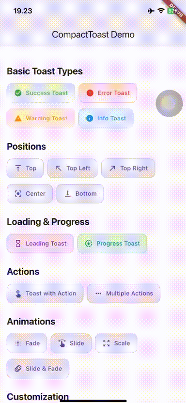

# CompactToast 🎉

A beautiful, customizable, and feature-rich toast notification plugin for Flutter with smooth animations, queue management, and flexible positioning.

[](https://pub.dev/packages/compact_toast)
[](https://opensource.org/licenses/MIT)

## 📱 Demo

<p align="center">
  
</p>

## ✨ Features

- 🎨 **Beautiful UI Design** - Pill-shaped toasts with smooth animations
- 🔔 **Multiple Toast Types** - Success, Error, Warning, Info, Loading, and Custom
- 📍 **Flexible Positioning** - 7 different positions (top, topLeft, topRight, center, bottom, bottomLeft, bottomRight)
- 🎭 **Rich Animations** - Fade, Slide, Scale, and combined animations
- 🔄 **Loading & Progress** - Built-in loading indicators with optional progress tracking
- 🎯 **Action Buttons** - Add interactive action buttons to toasts
- 👆 **Interactive** - Tap to dismiss, swipe to dismiss, or close button
- 🎨 **Fully Customizable** - Colors, icons, text styles, padding, and more
- 📦 **Queue Management** - Control how multiple toasts are displayed
- 🌓 **Dark Mode** - Automatically adapts to light/dark themes
- ⚡ **Performant** - Smooth 60fps animations
- 🎛️ **Global Configuration** - Set default behaviors app-wide

## 📦 Installation

Add this to your package's `pubspec.yaml` file:

```yaml
dependencies:
  compact_toast: ^0.0.1
```

Then run:

```bash
flutter pub get
```

## 🚀 Quick Start

### Basic Usage

```dart
import 'package:compact_toast/compact_toast.dart';

// Success toast
CompactToast.success(
  context,
  message: 'Operation completed successfully!',
);

// Error toast
CompactToast.error(
  context,
  message: 'Something went wrong',
);

// Warning toast
CompactToast.warning(
  context,
  message: 'Please check your input',
);

// Info toast
CompactToast.info(
  context,
  message: 'Did you know?',
);
```

### Loading Toast

```dart
// Show loading toast
final controller = CompactToast.loading(
  context,
  message: 'Processing...',
  showCloseButton: true,
);

// Dismiss when done
await someAsyncOperation();
controller.dismiss();
```

### Progress Toast

```dart
double progress = 0.0;
var controller = CompactToast.loading(
  context,
  message: 'Downloading... 0%',
  progress: 0.0,
);

// Update progress
for (int i = 0; i <= 100; i += 10) {
  await Future.delayed(Duration(milliseconds: 500));
  progress = i / 100;
  controller.dismiss();
  controller = CompactToast.loading(
    context,
    message: 'Downloading... $i%',
    progress: progress,
  );
}

controller.dismiss();
CompactToast.success(context, message: 'Download complete!');
```

## 🎯 Advanced Features

### Action Buttons

```dart
CompactToast.show(
  context,
  message: 'File deleted',
  type: ToastType.error,
  actions: [
    ToastAction(
      text: 'Undo',
      icon: Icons.undo,
      onTap: () {
        // Restore file
        CompactToast.success(context, message: 'File restored!');
      },
    ),
  ],
);
```

### Multiple Actions

```dart
CompactToast.show(
  context,
  message: 'New message received',
  type: ToastType.info,
  actions: [
    ToastAction(
      text: 'Reply',
      icon: Icons.reply,
      onTap: () => print('Reply tapped'),
    ),
    ToastAction(
      text: 'View',
      icon: Icons.visibility,
      onTap: () => print('View tapped'),
    ),
  ],
);
```

### Custom Positioning

```dart
CompactToast.show(
  context,
  message: 'Toast at bottom right',
  position: ToastPosition.bottomRight,
);
```

### Custom Animations

```dart
CompactToast.show(
  context,
  message: 'Fade animation',
  animationStyle: ToastAnimation.fade,
);

CompactToast.show(
  context,
  message: 'Scale animation',
  animationStyle: ToastAnimation.scale,
);

CompactToast.show(
  context,
  message: 'Slide and fade',
  animationStyle: ToastAnimation.slideAndFade,
);
```

### Custom Styling

```dart
CompactToast.show(
  context,
  message: 'Custom styled toast',
  backgroundColor: Colors.purple.shade50,
  textColor: Colors.purple.shade900,
  borderColor: Colors.purple,
  iconColor: Colors.purple,
  borderRadius: 20,
  showCloseButton: true,
);
```

### Custom Icon

```dart
CompactToast.custom(
  context,
  message: 'You earned a star!',
  icon: Icons.star,
  iconColor: Colors.amber,
);
```

### Dismiss Options

```dart
// Tap to dismiss
CompactToast.show(
  context,
  message: 'Tap me to dismiss',
  dismissOnTap: true,
  duration: Duration(seconds: 10),
);

// Swipe to dismiss
CompactToast.show(
  context,
  message: 'Swipe to dismiss',
  dismissDirection: ToastDismissDirection.horizontal,
);

// Close button
CompactToast.show(
  context,
  message: 'Click X to close',
  showCloseButton: true,
  duration: Duration(seconds: 10),
);
```

### Global Configuration

Set default behaviors for all toasts in your app:

```dart
void main() {
  CompactToast.configure(
    CompactToastConfig(
      defaultDuration: Duration(seconds: 4),
      defaultPosition: ToastPosition.bottom,
      defaultAnimation: ToastAnimation.slideAndFade,
      animationDuration: Duration(milliseconds: 300),
      showCloseButton: false,
      dismissOnTap: false,
      dismissDirection: ToastDismissDirection.horizontal,
      maxToasts: 3,
      toastGap: 8.0,
      queueMode: false,
      borderRadius: 50.0,
      enableShadow: true,
      enableBlur: false,
      margin: 20.0,
    ),
  );

  runApp(MyApp());
}
```

### Multiple Toasts

```dart
// Show multiple toasts simultaneously
CompactToast.success(context, message: 'First toast');
CompactToast.info(context, message: 'Second toast');
CompactToast.warning(context, message: 'Third toast');

// Clear all toasts
CompactToast.removeAll();
```

## 📖 API Reference

### CompactToast Methods

| Method        | Description                                  |
| ------------- | -------------------------------------------- |
| `show()`      | Show a toast with full customization options |
| `success()`   | Show a success toast                         |
| `error()`     | Show an error toast                          |
| `warning()`   | Show a warning toast                         |
| `info()`      | Show an info toast                           |
| `loading()`   | Show a loading toast with optional progress  |
| `custom()`    | Show a custom toast with custom icon         |
| `removeAll()` | Remove all active toasts                     |
| `configure()` | Set global configuration                     |

### ToastType

- `ToastType.success` - Green check icon
- `ToastType.error` - Red close icon
- `ToastType.warning` - Orange warning icon
- `ToastType.info` - Blue info icon
- `ToastType.loading` - Progress indicator
- `ToastType.custom` - Custom icon

### ToastPosition

- `ToastPosition.top` - Top center
- `ToastPosition.topLeft` - Top left corner
- `ToastPosition.topRight` - Top right corner
- `ToastPosition.center` - Center of screen
- `ToastPosition.bottom` - Bottom center
- `ToastPosition.bottomLeft` - Bottom left corner
- `ToastPosition.bottomRight` - Bottom right corner

### ToastAnimation

- `ToastAnimation.fade` - Fade in/out
- `ToastAnimation.slide` - Slide from position
- `ToastAnimation.slideAndFade` - Slide with fade
- `ToastAnimation.scale` - Scale from center
- `ToastAnimation.scaleAndFade` - Scale with fade

### ToastDismissDirection

- `ToastDismissDirection.horizontal` - Swipe left/right
- `ToastDismissDirection.vertical` - Swipe up/down
- `ToastDismissDirection.any` - Swipe any direction
- `ToastDismissDirection.none` - Disable swipe dismiss

### ToastAction

```dart
ToastAction({
  required String text,           // Button text
  required VoidCallback onTap,    // Tap callback
  Color? textColor,               // Text color
  Color? backgroundColor,         // Background color
  IconData? icon,                 // Optional icon
  bool dismissOnTap = true,       // Dismiss toast on tap
})
```

### CompactToastConfig

```dart
CompactToastConfig({
  Duration defaultDuration,              // Default toast duration
  ToastPosition defaultPosition,         // Default position
  ToastAnimation defaultAnimation,       // Default animation
  Duration animationDuration,            // Animation duration
  bool showCloseButton,                  // Show close button
  bool dismissOnTap,                     // Dismiss on tap
  ToastDismissDirection dismissDirection, // Swipe dismiss direction
  int maxToasts,                         // Max simultaneous toasts
  double toastGap,                       // Gap between toasts
  bool queueMode,                        // Queue mode
  double borderRadius,                   // Border radius
  Color? backgroundColor,                // Background color
  Color? textColor,                      // Text color
  Color? borderColor,                    // Border color
  double iconSize,                       // Icon size
  TextStyle? textStyle,                  // Text style
  bool enableShadow,                     // Enable shadow
  bool enableBlur,                       // Enable blur effect
  double margin,                         // Margin from edges
  EdgeInsets? padding,                   // Internal padding
})
```

## 🎨 Customization Examples

### Fully Customized Toast

```dart
CompactToast.show(
  context,
  message: 'Fully customized toast!',
  type: ToastType.custom,
  icon: Icons.celebration,
  iconColor: Colors.orange,
  backgroundColor: Colors.orange.shade50,
  textColor: Colors.orange.shade900,
  borderColor: Colors.orange,
  borderRadius: 16,
  iconSize: 28,
  duration: Duration(seconds: 5),
  position: ToastPosition.center,
  animationStyle: ToastAnimation.scaleAndFade,
  animationDuration: Duration(milliseconds: 400),
  showCloseButton: true,
  dismissOnTap: true,
  enableShadow: true,
  padding: EdgeInsets.all(16),
  actions: [
    ToastAction(
      text: 'Action',
      icon: Icons.touch_app,
      textColor: Colors.orange,
      onTap: () => print('Action pressed'),
    ),
  ],
);
```

## 🎯 Use Cases

- ✅ Form validation feedback
- 📁 File operation confirmations (upload, delete, etc.)
- 🔄 Background task progress
- 📧 Message notifications
- ⚠️ Warning alerts
- ℹ️ Informational tips
- ⏳ Loading states
- 🔔 In-app notifications

## 🤝 Contributing

Contributions are welcome! Please feel free to submit a Pull Request.

1. Fork the repository
2. Create your feature branch (`git checkout -b feature/AmazingFeature`)
3. Commit your changes (`git commit -m 'Add some AmazingFeature'`)
4. Push to the branch (`git push origin feature/AmazingFeature`)
5. Open a Pull Request

## 📄 License

This project is licensed under the MIT License - see the [LICENSE](LICENSE) file for details.

## 🙏 Acknowledgments

- Inspired by modern toast notification designs
- Built with Flutter's powerful animation system
- Uses Material Design principles

## 📧 Contact

For questions or suggestions, please open an issue on [GitHub](https://github.com/Caqil/compact_toast/issues).

---

Made with ❤️ by Caqil
